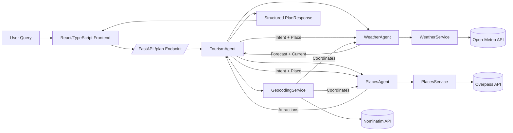

# Multi-Agent Tourism Planner

A modern, intelligent tourism planning web application that interprets natural language queries to provide weather insights and nearby attractions for destinations worldwide. The system uses a multi-agent architecture (parent orchestration + specialized child agents) to run tasks in parallel, minimizing latency while preserving clarity and reliability.

## Table of Contents
1. Overview
2. Core Features
3. Architecture
4. Data Flow & Intent Logic
5. Technology Stack
6. API Endpoints
7. Place Extraction & Normalization
8. Intent Determination Rules
9. External Data Sources
10. Frontend UI/UX Principles
11. Setup & Development
12. Future Enhancements
13. License / Usage Notes

## 1. Overview
Users enter free-form queries such as:
- "plan my trip to Paris"
- "weather in Rome"
- "I m going to malleshwaram, make my trip plan"
- "Hyderabad"

The TourismAgent extracts the destination, determines user intent (weather only, planning only, both, or default), and invokes child agents accordingly:
- WeatherAgent → WeatherService → Open-Meteo API
- PlacesAgent → PlacesService → Overpass API (OpenStreetMap)
- GeocodingService → Nominatim for latitude/longitude.

Responses are returned as structured JSON (PlanResponse) and rendered in a React/TypeScript frontend.

## 2. Core Features
- Natural language place extraction (multi-word, capitalization, prepositions, fallback strategies)
- Adaptive intent mapping (planning vs weather vs both)
- Parallel execution of independent agents (async gather) for speed
- Current weather + 7-day forecast (temperature range + rain probability)
- Nearby attractions (progressive radius search; de-duplication; ASCII filtering)
- State/country fallback mapping to major/capital cities when granular geocoding fails
- Robust alias normalization for select neighborhoods (e.g., Bangalore localities)
- Structured, deterministic responses for ergonomic frontend consumption
- Clean, responsive, accessible UI with travel-themed styling & animated loader

## 3. Architecture


## 4. Data Flow & Intent Logic
1. User submits a free-form query.
2. TourismAgent performs `_extract_place()` using:
   - Preposition pattern capture ("to", "in", "going to", etc.)
   - Capitalization heuristic
   - Multi-word backward fallback (3-word, 2-word, single)
   - Stop-word trimming (including planning verbs, pronouns, generic request words)
3. Place normalization: alias → fallback city (state/country) → geocoding attempt.
4. Intent rules (see Section 8) decide which agents to run.
5. WeatherAgent & PlacesAgent run concurrently if both needed.
6. Results merged into PlanResponse with `weather`, `places`, and descriptive message.

## 5. Technology Stack
- Backend: Python, FastAPI, httpx, asyncio, pydantic
- Frontend: React, TypeScript, Vite, Tailwind CSS
- External APIs: Open-Meteo (weather), Overpass (tourism attractions), Nominatim (geocoding)

## 6. API Endpoints
### POST /plan
Request body:
```json
{ "query": "plan my trip to Paris" }
```
Response (example):
```json
{
  "place": "paris",
  "used_agents": ["WeatherAgent", "PlacesAgent"],
  "weather": {
    "current_temperature": 12.4,
    "current_rain_chance": 10,
    "summary": "In paris it's currently 12.4°C with a chance of 10% to rain.",
    "forecast": [
      { "date": "2025-11-23", "temp_min": 7.2, "temp_max": 13.8, "rain_prob": 20 },
      { "date": "2025-11-24", "temp_min": 6.9, "temp_max": 14.1, "rain_prob": 30 }
    ]
  },
  "places": ["Louvre Museum", "Eiffel Tower", "Notre-Dame Cathedral", "Orsay Museum", "Montmartre"],
  "message": "In paris it's currently 12.4°C ... | Places: Louvre Museum, Eiffel Tower, ...",
  "error": null
}
```

## 7. Place Extraction & Normalization
- Regex for contextual phrases: captures tokens after travel verbs ("going to", "travel to") and prepositions.
- Removal of leading/trailing stop-words (e.g., "go to", "make", "my", "trip", etc.).
- Capitalization fallback for queries typed with case.
- Multi-word backward search ensures capturing neighborhoods ("hsr layout").
- Alias maps provide enriched context adding city/state for ambiguous localities.
- Fallback map for states and countries to major/capital cities when direct geocoding fails.

## 8. Intent Determination Rules
Applied in `plan()`:
- Weather-only: contains weather keywords (weather, temperature, forecast, rain) and no planning keywords.
- Places-only: contains planning keywords (plan my trip, plan, help me plan, places, tourist, attractions) and no weather keywords.
- Both: both keyword sets present.
- Single word exact place query: both.
- No specification: both.

## 9. External Data Sources
- Open-Meteo: current temperature & rain probability + daily forecast.
- Overpass (OpenStreetMap): tourism attractions (progressive radii: 5km, 15km, fallback 50km if needed).
- Nominatim: forward geocoding for place validation; states/countries fallback to capital/major city mapping.

## 10. Frontend UI/UX Principles
- Hero search + examples for discoverability.
- Responsive grid for forecast & attractions.
- Travel-themed color palette (deep navy, teal, warm orange, soft beige).
- Animated travel loader (plane + clouds) signals task progress.
- Clean typography (Inter / Nunito Sans) & subtle gradients.
- Accessible focus states and semantic structure (sections, headings).

## 11. Setup & Development
### Prerequisites
- Node.js (>=16) & npm
- Python 3.10+

### Backend
```powershell
python -m venv venv
./venv/Scripts/activate
pip install -r requirements.txt  # (generate if not present)
uvicorn backend.app.main:app --reload
```

### Frontend
```powershell
cd frontend
npm install
npm run dev
```
Visit: http://localhost:5173 (or chosen port).

## 12. Future Enhancements
- Persistent caching of geocoding & attractions.
- Internationalization / multi-language intent phrases.
- User-selectable theme (light / dark / high contrast).
- Rate limiting & circuit breaker for external APIs.
- GraphQL or streaming responses for progressive rendering.
- Add test suite (unit + integration) for extraction & intent logic.

## 13. License / Usage Notes
This project integrates third-party APIs bound by their respective usage policies (OpenStreetMap, Open-Meteo). Ensure compliance for production use. Provided as an educational/demo implementation of multi-agent orchestration patterns.

---
**Status:** Active development; UI and intent logic recently refined for stricter semantic behavior.

Feel free to extend or adapt the architecture diagram for deployment or scaling scenarios.
